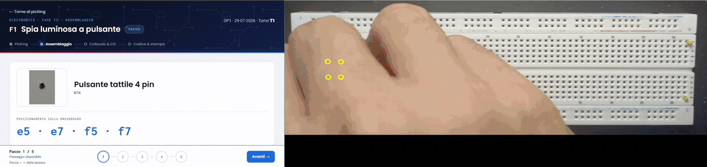

# Smart Factory Assistant

Progetto realizzato per l'esame di **Smart Factory** — Laurea Magistrale in Ingegneria
Gestionale, Sapienza Università di Roma.



Demo completa di una commessa (video accelerato):

https://github.com/user-attachments/assets/286e1a20-4c9d-40ee-9f71-aa63478492e3

## Il problema

Un operatore monta circuiti su breadboard seguendo un manuale. Ogni
componente ha fori precisi. Se sbaglia un foro, se ne accorge solo al
collaudo, quando il circuito non funziona: deve cercare il guasto sulla
board finita.

## L'obiettivo

Riconoscere l'errore mentre il componente viene inserito, così che non
arrivi al collaudo.

## Come

- **Webapp operatore**: il manuale diventa una sequenza, un passo alla
  volta, con i fori scritti nel passo.
- **Assistente (LLM + RAG)**: risponde alle domande dell'operatore.
  Su fori e montaggio usa solo il manuale.
- **Controllo in linea (VLM)**: una camera guarda la board a ogni
  inserimento e confronta componente e fori con la scheda della commessa.
  Verde = ok, giallo = controlla a vista, rosso = errore e perché.

## Limiti

Il sistema segnala ma non blocca: intercetta la maggior parte degli
errori, non tutti, e il collaudo resta necessario. Una sola camera
dall'alto non vede la polarità.

## I due moduli

### `1-webapp-llm/` — Webapp operatore + assistente LLM

Interfaccia web per l'operatore (HTML/JS, servita da FastAPI) con sequenza di montaggio,
foto dei componenti, registrazione dei tempi di fase e un assistente conversazionale.

L'assistente è un sistema **RAG**: il manuale operativo, la guida della webapp e un testo di
fondamenti di elettronica vengono spezzati in chunk e indicizzati in **ChromaDB**; a ogni
domanda si recuperano i passaggi pertinenti e si passano a **Gemini**. Su posizioni,
versi e polarità risponde solo dal manuale; se il dato manca lo dice invece di stimarlo.
Accetta testo e audio, mantiene la memoria della sessione e ruota
su più chiavi API in caso di quota esaurita.

### `2-vlm/` — Controllo qualità in linea (VLM)

Un telefono Android (app *IP Webcam*) inquadra la breadboard dall'alto e scatta a
intervalli regolari. Per ogni scatto utile (niente mani, niente movimento) il programma:

1. rileva localmente (OpenCV) cosa è cambiato rispetto allo scatto precedente;
2. chiede a un modello visivo (Gemini) di che componente si tratta;
3. confronta posizione, classe e colore con il **golden** della commessa
   (`manuale/golden-data.json`);
4. emette un verdetto verde / giallo / rosso, mostrato in finestra e passato alla webapp
   tramite `data/ponte/`.

## Stack

Python 3.11+ · FastAPI · ChromaDB · Google Gemini API · OpenCV · NumPy/SciPy ·
HTML/JS vanilla

## Struttura

```text
1-webapp-llm/
├── AVVIA WEBAPP.bat           # avvio con doppio click
├── chatbotLLM/
│   ├── server.py              # FastAPI: /api/chat, /chat-audio, /tempi, /vlm/*, pagina statica
│   ├── rebuild_kb.py          # ricostruisce db_vector/ dai .md in data/
│   ├── core/                  # rotazione chiavi, chunking, RAG, contesto, chatbot, sessioni
│   ├── data/                  # manuale operativo, guida webapp, fondamenti (markdown)
│   └── db_vector/             # ChromaDB già popolato
└── WEBAPP/
    ├── mockups-flusso/        # pagina operatore (HTML + JS)
    ├── assets/                # foto componenti e schemi circuiti
    └── intro/                 # video di apertura

2-vlm/
├── Avvia Radar.bat
├── manuale/golden-data.json   # golden di ogni commessa: componente, fori, colore
├── src/
│   ├── radar/                 # cattura, gate, verdetto, interfaccia, telemetria
│   ├── probe/                 # geometria dei fori, diff tra scatti, accesso al VLM
│   └── offline/               # replay delle run salvate
└── data/riferimenti/          # ritagli di riferimento
```

## Avvio

Requisiti: Windows 10/11, Python 3.11+, una chiave API Google Gemini.
**Nessuna chiave è inclusa nel repository.**

```bat
:: Webapp + assistente
cd 1-webapp-llm\chatbotLLM
pip install -r requirements.txt
:: creare data\keys.txt con una chiave Gemini per riga
cd ..
"AVVIA WEBAPP.bat"            :: apre http://localhost:8000

:: Controllo qualità (serve il telefono con IP Webcam sulla stessa rete)
cd 2-vlm
pip install -r requirements.txt
:: creare chiave.txt con una chiave Gemini (oppure variabile d'ambiente QC_CHIAVE)
"Avvia Radar.bat"
```

## Cosa non c'è nel repository

Manuale operativo in PDF, foto grezze dei componenti, run e registri sperimentali,
valutazioni: materiale di corso o di lavoro, non necessario per eseguire il codice.

## Sviluppo

Codice sviluppato con Claude Code.
